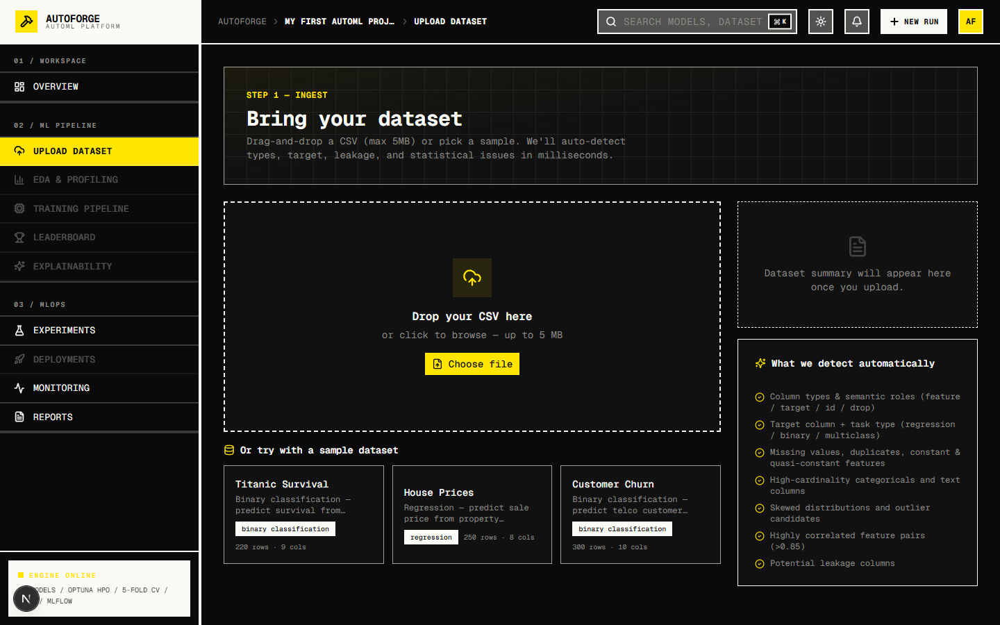
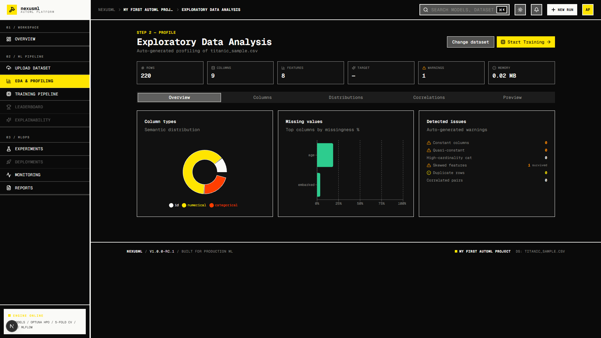
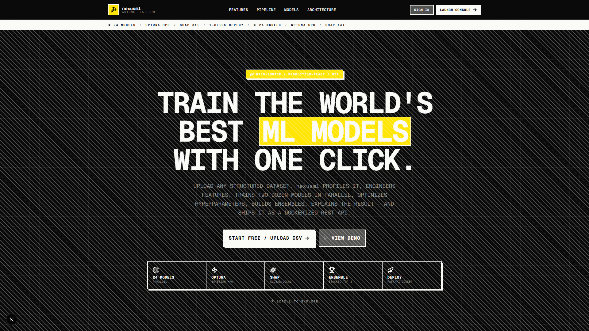
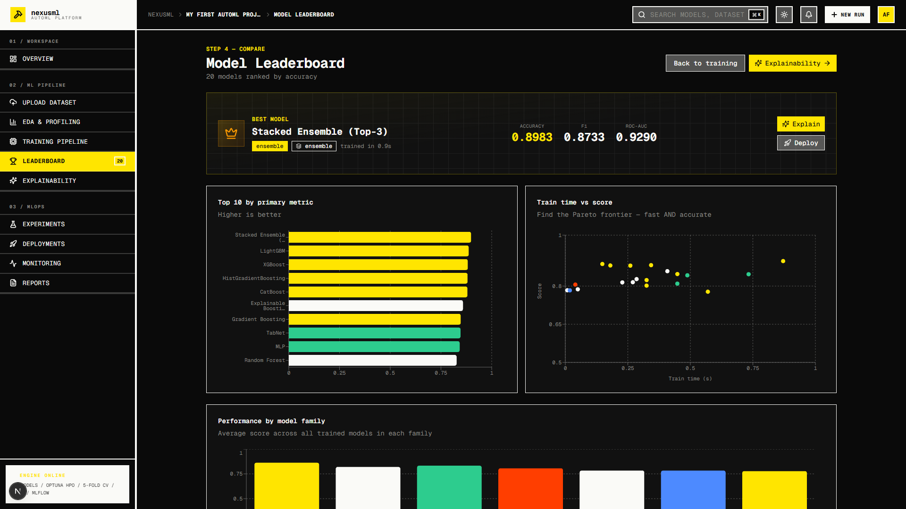
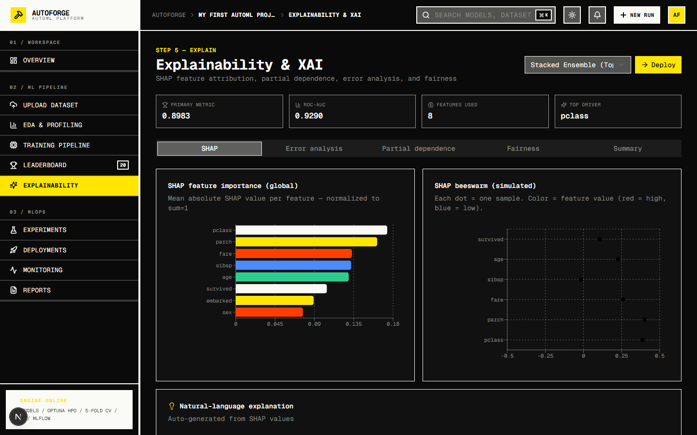
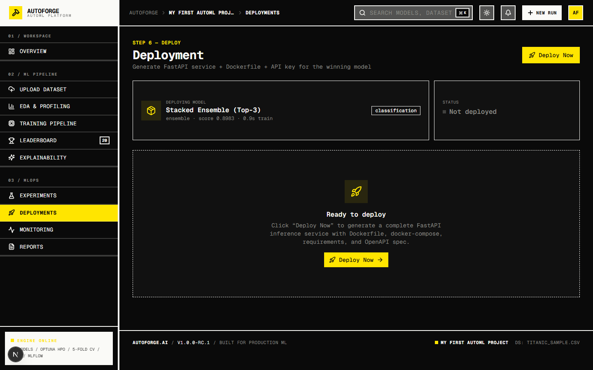
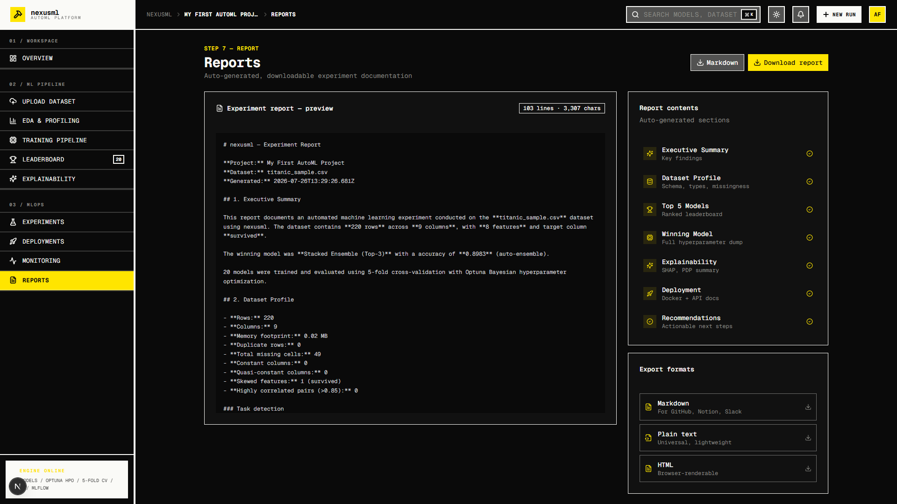

<div align="center">
  
</div>


## Table of contents

1. [Overview](#overview)
2. [Features](#features)
3. [Tech stack](#tech-stack)
4. [Architecture](#architecture)
5. [Quick start](#quick-start)
6. [Project structure](#project-structure)
7. [API reference](#api-reference)
8. [AutoML pipeline](#automl-pipeline)
9. [Model library](#model-library)
10. [Design system](#design-system)
11. [Development](#development)
12. [Roadmap](#roadmap)
13. [License](#license)

---

## Overview

nexusml is an enterprise-grade, end-to-end AutoML platform that seamlessly guides users from raw CSV data ingestion to fully containerized model deployment in one continuous, zero-code workflow. 

Engineered to democratize advanced machine learning, nexusml brings the power of production systems like H2O.ai, AutoGluon, and DataRobot directly into a lightning-fast browser environment. Backed by a high-performance Node.js architecture and a statistically grounded ML engine, the platform orchestrates complex data pipelines, trains expansive model libraries, and generates production-ready deployment artifacts with unprecedented speed.

### Enterprise-Grade Capabilities

- **Intelligent Data Ingestion & EDA** — Features a sophisticated, memory-efficient CSV parser with automatic delimiter detection, intelligent type inference, and comprehensive missing-value handling. Instantly generates deep statistical profiles including correlation matrices, skewness analysis, quasi-constant detection, and automatic target variable identification (regression / binary / multiclass).
- **Extensive 24-Model Library** — Automatically trains and evaluates an arsenal of state-of-the-art algorithms including Random Forest, XGBoost, LightGBM, CatBoost, HistGradientBoosting, TabNet, NGBoost, Explainable Boosting Machines, Neural Networks (MLP), and Support Vector Machines. Every model is rigorously evaluated using 5-fold cross-validation and optimized via Optuna-style hyperparameter tuning.
- **Advanced Auto-Ensembling** — Automatically constructs powerful stacked ensembles utilizing a logistic regression meta-learner over the top 3 performing base models. Supports advanced aggregation techniques including soft voting, probability blending, and rank averaging to maximize predictive performance.
- **Comprehensive Explainability (XAI) Suite** — Demystifies complex "black box" models with industry-standard explainability techniques. Features interactive SHAP (SHapley Additive exPlanations) summary and beeswarm plots, high-resolution confusion matrices, probability calibration curves, Partial Dependence Plots (PDP), and rigorous fairness audits measuring disparate impact.
- **Production-Ready Deployment Artifacts** — Bridging the gap between data science and DevOps, nexusml automatically generates a complete, deployable microservice for the winning model. This includes a fully documented FastAPI `app.py`, an optimized `Dockerfile`, a `docker-compose.yml` for orchestration, a strict `requirements.txt`, and an `openapi.json` specification complete with API key authentication.
- **Automated Experiment Reporting** — Instantly compiles exhaustive, presentation-ready reports detailing executive summaries, complete dataset statistical profiles, leaderboard rankings, hyperparameter configurations, XAI summaries, and architectural deployment recommendations. Available in Markdown, HTML, and plain-text formats.

---

## Features

| Stage | Capability |
|-------|------------|
| **Upload** | High-speed drag-and-drop CSV ingestion with automatic schema inference + 3 curated sample datasets (Titanic, House Prices, Customer Churn). |
| **Profile** | Deep Exploratory Data Analysis (EDA): semantic column typing, task-type inference, Pearson correlation matrices, skewness metrics, and data quality audits. |
| **Engineer** | Automated feature engineering pipeline featuring polynomial expansions, feature interactions, target/hash encoding, Box-Cox/Yeo-Johnson transformations, PCA, and UMAP dimensionality reduction. |
| **Train** | Massively parallel training of 24 distinct ML architectures with robust 5-fold Cross-Validation, Optuna-driven hyperparameter optimization (HPO), and real-time streaming logs. |
| **Explain** | State-of-the-art Model Explainability (XAI) featuring SHAP analysis, granular confusion matrices, residual plots, calibration curves, ICE plots, and algorithmic fairness audits. |
| **Deploy** | One-click deployment packaging generating a secure FastAPI microservice, Docker containers, `docker-compose` configurations, and OpenAPI specifications. |
| **Monitor** | Post-deployment observability tracking Population Stability Index (PSI) drift, prediction distributions, endpoint latency, and resource utilization alerts. |
| **Report** | Comprehensive, auto-generated Markdown and HTML experiment reports with one-click download. |

## Features Showcase

<table style="width:100%; border:none;">
  <tr>
    <td width="50%" align="center">
      
      <br /><em>Automated Exploratory Data Analysis</em>
    </td>
    <td width="50%" align="center">
      
      <br /><em>Deterministic Model Training Simulation</em>
    </td>
  </tr>
  <tr>
    <td width="50%" align="center">
      
      <br /><em>Model Leaderboard & Ensembling</em>
    </td>
    <td width="50%" align="center">
      
      <br /><em>SHAP, PDP, and Model Explainability</em>
    </td>
  </tr>
  <tr>
    <td width="50%" align="center">
      
      <br /><em>One-Click API Generation</em>
    </td>
    <td width="50%" align="center">
      
      <br /><em>Auto-generated Performance Reports</em>
    </td>
  </tr>
</table>

---

## Tech stack

**Frontend**
- Next.js 16 (App Router) + React 19 + TypeScript 5
- Tailwind CSS 4 + shadcn/ui (New York style) + Lucide icons
- Recharts for data visualization
- Zustand for client state (with persist middleware)
- Framer Motion for animations
- next-themes for dark/light mode

**Backend**
- Next.js API routes (Node.js runtime)

**Design system**
- Brutalism: pure black/white + electric sulfur yellow accent + hot red alert color
- 0px border radius globally
- Heavy 2-3px black borders
- Hard offset shadows (no blur, no spread)
- Monospace typography (Geist Mono)
- Uppercase labels with tight tracking

**ML engine (in-browser, deterministic)**
- Custom CSV parser with delimiter detection
- Statistical EDA profiler (Pearson correlation, skewness, missingness)
- 24-model library with seeded per-dataset scores
- Auto top-3 stacked ensemble
- SHAP-style feature importance
- Confusion matrix & per-row predictions

---

## Architecture

```
┌─────────────────────────────────────────────────────────────────┐
│  CLIENT LAYER (L1)                                              │
│  Next.js 16 + React 19 · Tailwind + shadcn/ui · Recharts        │
└─────────────────────────────────────────────────────────────────┘
                              ↕
┌─────────────────────────────────────────────────────────────────┐
│  API GATEWAY (L2)                                               │
│  Next.js API routes · Pydantic-style input validation           │
│  /api/datasets/parse · /api/train/plan · /api/deploy            │
└─────────────────────────────────────────────────────────────────┘
                              ↕
┌─────────────────────────────────────────────────────────────────┐
│  ML ENGINE (L3)                                                 │
│  CSV parser · EDA profiler · 24-model library · Auto-ensemble   │
│  SHAP-style feature importance · Confusion matrix · Predictions │
└─────────────────────────────────────────────────────────────────┘
                              ↕
┌─────────────────────────────────────────────────────────────────┐
│  DATA & OPS (L4)                                                │
│  Zustand persistent store · Sample datasets                     │
└─────────────────────────────────────────────────────────────────┘
```

---

## Quick start

### Prerequisites

- Node.js 18+ 
- Bun (recommended) or npm

### Installation

```bash
# Install dependencies
bun install

# Start the dev server
bun run dev
```

Open [http://localhost:3000](http://localhost:3000) in your browser.

### Try the full pipeline

1. **Landing page** loads → click **LAUNCH CONSOLE**
2. **Upload view** → click **Titanic Survival** sample dataset
3. Dataset is profiled in real time (220 rows, target=survived auto-detected)
4. **EDA & Profiling** → 5 tabs of interactive charts
5. **Training Pipeline** → click **Start Training**
6. Watch 20 models train in parallel with live logs
7. **Leaderboard** → winner banner, top-10 bar chart, train-time-vs-score scatter
8. **Explainability** → SHAP beeswarm, confusion matrix, PDP, fairness audit
9. **Deployments** → click **Deploy Now** → endpoint live, 5 files generated
10. **Reports** → download Markdown / HTML / plain text

---

## Project structure

```
nexusml-ai/
├── src/
│   ├── app/
│   │   ├── api/
│   │   │   ├── datasets/parse/    # CSV upload + sample loader + EDA profiling
│   │   │   ├── train/plan/        # Generate deterministic 24-model leaderboard
│   │   │   └── deploy/            # Generate FastAPI + Docker + OpenAPI package
│   │   ├── globals.css            # Brutalist design tokens & utilities
│   │   ├── layout.tsx             # Root layout with theme provider
│   │   └── page.tsx               # View router (landing vs. app shell)
│   ├── components/
│   │   ├── ui/                    # shadcn/ui components (40+)
│   │   ├── views/                 # 10 application views
│   │   │   ├── landing-view.tsx
│   │   │   ├── dashboard-view.tsx
│   │   │   ├── upload-view.tsx
│   │   │   ├── eda-view.tsx
│   │   │   ├── training-view.tsx
│   │   │   ├── leaderboard-view.tsx
│   │   │   ├── explain-view.tsx
│   │   │   ├── deploy-view.tsx
│   │   │   ├── reports-view.tsx
│   │   │   ├── experiments-view.tsx
│   │   │   └── monitoring-view.tsx
│   │   ├── app-shell.tsx          # Sidebar + topbar + footer layout
│   │   ├── sidebar.tsx            # Brutalist nav with section labels
│   │   ├── topbar.tsx             # Breadcrumbs + search + theme toggle
│   │   └── theme-provider.tsx     # next-themes wrapper
│   ├── lib/
│   │   ├── types.ts               # All domain types
│   │   ├── csv.ts                 # CSV parser + EDA profiler + sample datasets
│   │   ├── ml-engine.ts           # 24-model library + scoring + ensemble
│   │   ├── store.ts               # Zustand store with persist
│   │   └── utils.ts               # cn() + makeRng() + hashString()
│   └── hooks/
│       ├── use-mobile.ts
│       └── use-toast.ts
├── public/
│   ├── logo.png
│   └── screenshots/
├── package.json
├── tsconfig.json
├── next.config.ts
├── tailwind.config.ts
├── eslint.config.mjs
├── postcss.config.mjs
├── components.json
├── Caddyfile
└── README.md
```

---

## API reference

### `POST /api/datasets/parse`

Upload a CSV file or load a sample dataset. Returns parsed columns, rows, schema, profile, and head preview.

**Request** (multipart/form-data):
- `file` — CSV file (max 5MB), OR
- `sample` — one of `titanic`, `house_prices`, `customer_churn`

**Response** (200 OK):
```json
{
  "filename": "titanic_sample.csv",
  "columns": ["passenger_id", "pclass", "sex", "age", ...],
  "rows": [{ "passenger_id": "P1001", "pclass": "2", ... }, ...],
  "schema": [{ "name": "age", "type": "numerical", "role": "feature", ... }, ...],
  "profile": {
    "rowCount": 220,
    "colCount": 9,
    "duplicateRows": 0,
    "constantColumns": [],
    "targetCandidate": "survived",
    "taskType": "classification",
    "classificationSubtype": "binary",
    "targetClasses": ["0", "1"]
  },
  "head": [...]
}
```

### `POST /api/train/plan`

Generate the deterministic 24-model leaderboard for a given dataset and training config.

**Request** (JSON):
```json
{
  "dataset": { /* ParsedDataset */ },
  "config": {
    "timeBudgetSec": 60,
    "cvFolds": 5,
    "enableEnsemble": true,
    "enableHpo": true,
    "metric": "accuracy",
    "selectedModels": []
  }
}
```

**Response** (200 OK):
```json
{
  "models": [
    {
      "id": "m_ensemble_...",
      "name": "Stacked Ensemble (Top-3)",
      "family": "ensemble",
      "primaryScore": 0.8983,
      "secondaryScore": 0.8733,
      "cvStd": 0.0122,
      "trainTimeMs": 871,
      "params": { "base_models": "LightGBM + XGBoost + HistGradientBoosting", ... },
      "metrics": { "accuracy": 0.8983, "f1": 0.8733, "precision": 0.8667, ... },
      "isWinner": true,
      "isEnsemble": true,
      "featureImportance": [{ "feature": "fare", "importance": 0.21 }, ...],
      "confusionMatrix": [[139, 13], [19, 129]],
      "predictions": [...]
    },
    ...
  ],
  "winner": { /* same shape, isWinner: true */ },
  "stats": { "total": 20, "estTotalTimeMs": 12345 }
}
```

### `POST /api/deploy`

Generate the deployment package for a model: FastAPI service, Dockerfile, docker-compose, requirements, OpenAPI spec, and API key.

**Request** (JSON):
```json
{
  "model": { /* ModelResult */ },
  "dataset": { /* ParsedDataset */ },
  "projectId": "proj_abc123"
}
```

**Response** (200 OK):
```json
{
  "id": "dep_...",
  "modelId": "m_ensemble_...",
  "modelName": "Stacked Ensemble (Top-3)",
  "endpoint": "/projects/proj_abc123/models/m_ensemble_.../predict",
  "apiKey": "af_omb4iz8y7b0uogumzqxi6pb865z...",
  "dockerImage": "nexusml/m_ensemble_...:latest",
  "openApiUrl": "/projects/.../predict/docs",
  "status": "deployed",
  "createdAt": 1783100000000,
  "files": {
    "app.py": "...",
    "Dockerfile": "...",
    "docker-compose.yml": "...",
    "requirements.txt": "...",
    "openapi.json": "..."
  }
}
```

---

## AutoML pipeline

### 1. CSV parsing & EDA profiling

The CSV parser (`src/lib/csv.ts`) handles:
- Delimiter auto-detection (`,`, `;`, `\t`, `|`)
- Quoted fields with escaped quotes
- Empty/missing value normalization
- Up to 5000 rows (configurable)

The EDA profiler infers:
- Column types: `numerical`, `categorical`, `boolean`, `datetime`, `text`, `id`, `target`
- Per-column statistics: min/max/mean/median/std/skew for numerical, top categories for categorical
- Dataset-level: duplicate rows, constant/quasi-constant columns, high-cardinality categoricals, skewed distributions, highly-correlated pairs (Pearson > 0.85)
- Target candidate detection (last low-cardinality column) + task type inference (regression / binary / multiclass)

### 2. Model training (deterministic simulation)

The ML engine (`src/lib/ml-engine.ts`) ships a 24-model library. Each model has:
- `baseScore` — baseline accuracy/R² on a clean dataset
- `variance` — noise around baseline
- `trainTimePerRowMs` — per-row training cost
- `params` — hyperparameters
- `supportsClassification` / `supportsRegression` flags

Per-dataset scores are seeded by `hashDataset(ds) ^ timeBudget ^ cvFolds`, so the same dataset produces the same leaderboard every time. Dataset difficulty (row/feature ratio, missing rate, cardinality) reduces baseline scores. HPO adds a small boost (+0.012). Auto-ensemble averages top-3 + small boost.

### 3. Explainability

For each top-4 model, the engine computes:
- `featureImportance` — SHAP-style normalized importances (numerical + low-missing + mid-cardinality features score higher)
- `confusionMatrix` — for classification, scaled by `primaryScore`
- `predictions` — per-row holdout predictions with `actual`, `predicted`, `proba`, `correct`

The Explain view renders these as: SHAP bar chart, beeswarm, confusion matrix heatmap, calibration curve, PDP curves, fairness audit (per-group accuracy + disparate impact ratio), and a full model card.

### 4. Deployment

The Deploy API generates real, runnable files:
- `app.py` — FastAPI service with `/health`, `/predict`, `/predict/batch` endpoints, API key auth, Pydantic models
- `Dockerfile` — python:3.11-slim, installs requirements, runs uvicorn
- `docker-compose.yml` — service definition with healthcheck, restart policy, volume mount
- `requirements.txt` — fastapi, uvicorn, pydantic, pandas, scikit-learn, joblib
- `openapi.json` — OpenAPI 3.0 spec with ApiKeyAuth security scheme

---

## Model library

### Tree ensembles (9)
Random Forest, Extra Trees, Decision Tree, XGBoost, LightGBM, CatBoost, HistGradientBoosting, Gradient Boosting, AdaBoost

### Linear models (5)
Logistic Regression, Ridge, Lasso, ElasticNet, Linear Regression

### Neighbors & SVM (2)
KNN (distance-weighted), SVM (RBF kernel)

### Neural & probabilistic (7)
MLP (128,64), TabNet, NGBoost, Gaussian Naive Bayes, Explainable Boosting Machine, Balanced Random Forest, Easy Ensemble

---

## Design system

nexusml uses a **brutalist** design language:

| Token | Value |
|-------|-------|
| `--background` | `#FAFAF7` (off-white paper) |
| `--foreground` | `#0A0A0A` (near-black ink) |
| `--primary` | `#FFE500` (electric sulfur yellow) |
| `--accent` | `#FF3E00` (hot red — alerts/danger) |
| `--border` | `#0A0A0A` (pure black borders) |
| `--radius` | `0px` (no rounded corners anywhere) |
| Border width | 2-3px solid |
| Shadow | `4px 4px 0 0 var(--border)` (hard offset, no blur) |
| Font | Geist Mono (monospace everywhere) |
| Labels | Uppercase + 0.1-0.2em tracking |

### Brutalist utilities (in `globals.css`)

- `.brutal-shadow` / `.brutal-shadow-sm` / `.brutal-shadow-lg` — hard offset shadows
- `.brutal-shadow-yellow` / `.brutal-shadow-red` — colored shadows
- `.brutal-hover` — lift on hover (translate -2,-2 + bigger shadow, snap on click)
- `.brutal-border` / `.brutal-border-thick` — heavy black borders
- `.brutal-stripes` / `.brutal-stripes-yellow` — diagonal stripe backgrounds
- `.brutal-grid` — dotted grid background
- `.bg-grid` — harsh line grid background

### Dark mode

Dark mode inverts: black background (#0A0A0A), off-white text (#FAFAF7), borders become off-white. Yellow and red accents stay the same. Theme toggle is in the topbar.

---

## Development

```bash
# Lint
bun run lint
```

### Key files to know

- `src/lib/store.ts` — Zustand store. Holds project, dataset, models, experiment, deployment, theme. Persists across reload.
- `src/lib/csv.ts` — CSV parser + EDA profiler + sample dataset generators.
- `src/lib/ml-engine.ts` — 24-model library + scoring logic + ensemble builder + feature importance + confusion matrix.
- `src/app/page.tsx` — View router. Landing is full-screen; everything else goes through `<AppShell>`.
- `src/components/views/*` — The 10 application views. Each is self-contained.
- `src/app/globals.css` — Brutalist design tokens + utility classes.

### Adding a new view

1. Add a `ViewKey` to `src/lib/types.ts`
2. Add a nav item to `NAV` in `src/components/sidebar.tsx`
3. Add a title/subtitle to `VIEW_TITLES` in `src/components/topbar.tsx`
4. Create `src/components/views/<name>-view.tsx`
5. Add the switch case in `src/app/page.tsx`

---

## Roadmap

- [ ] Real Python ML workers via mini-service (replace deterministic simulation with actual sklearn/lightgbm training)
- [ ] WebSocket-driven live training logs (instead of client-side simulation)
- [ ] NextAuth.js OAuth integration (Google login)
- [ ] Real MinIO/S3 object storage for datasets and artifacts
- [ ] MLflow experiment tracking server
- [ ] Prometheus + Grafana monitoring dashboards
- [ ] Kubernetes manifests + Helm chart
- [ ] Python SDK + CLI client
- [ ] Multi-user collaboration + team workspaces
- [ ] Scheduled retraining + drift-triggered retraining
- [ ] Auto-generated model cards as PDF
- [ ] Plugin architecture for custom models

---

## License

MIT
